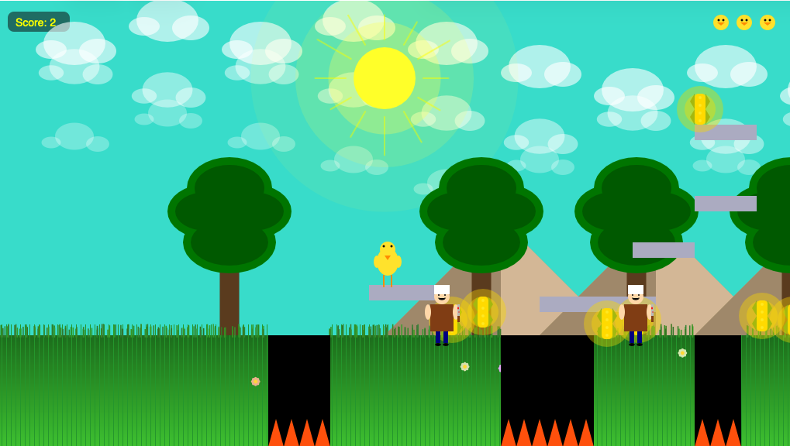

# Chicken Run



A 2D side-scrolling platformer built with [p5.js](https://p5js.org/) during my university studies while learning JavaScript. You play as a chicken collecting corn, dodging butchers, jumping canyons, and racing to the flagpole. Playable on desktop (keyboard) and mobile (on-screen touch controls).

## Play it

Open `index.html` in a browser, or run a local server:

```bash
npx http-server .
```

## Features

- Side-scrolling camera and parallax mountains/clouds
- Platforming with jumping, falling, and canyon hazards
- Collectables (corn) and score tracking
- Enemies (butchers) to avoid
- Flying mode, lives system, and win/lose states
- Sound effects and background music

## Tech

- [p5.js](https://p5js.org/) and p5.sound for rendering, input, and audio
- Vanilla JavaScript (`sketch.js`)
